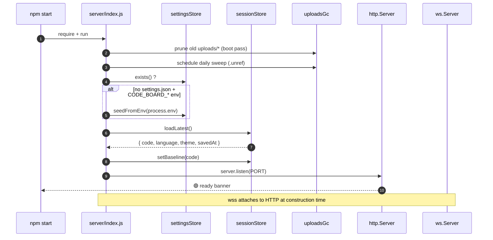
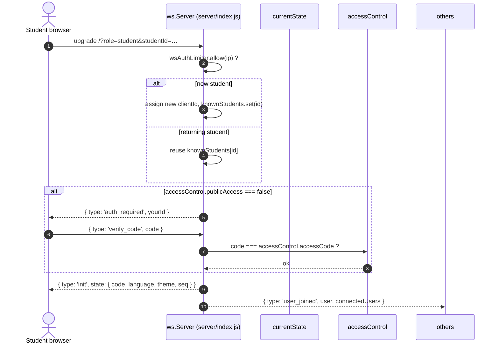
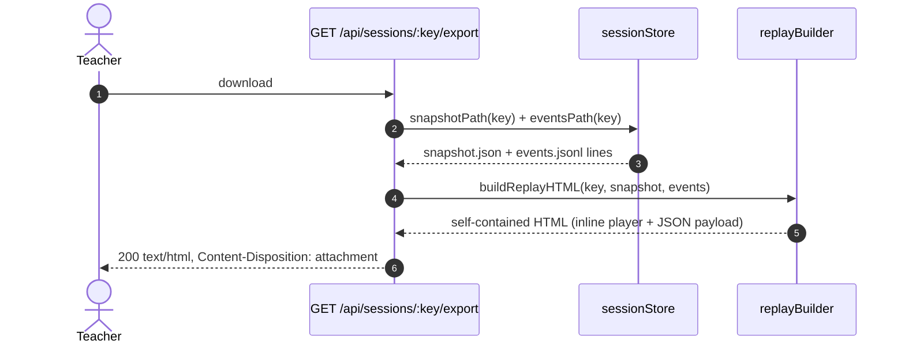

# Architecture

A bird's-eye view of how the parts of Code Board fit together. Phase 10.5
of the project ROADMAP.

---

## 1. Module map

```
code_board/
├─ server/                          # Node.js + Express + ws
│  ├─ index.js                      # HTTP routes, WS dispatcher, boot
│  ├─ middleware/                   # security, logging, rate-limit
│  └─ services/
│     ├─ settingsStore.js           # data/settings.json (+ deep-merge)
│     ├─ sessionStore.js            # rotating snapshots + events.jsonl
│     ├─ replayBuilder.js           # self-contained HTML replay export
│     ├─ languageRegistry.js        # Phase 5 — pluggable languages
│     └─ uploadsGc.js               # daily TTL prune for uploads/
│
├─ src/                             # Browser-side, plain ES (no bundler)
│  ├─ main.js                       # boot entrypoint
│  ├─ core/
│  │  ├─ LanguageManager.js         # which language is "current"
│  │  ├─ SmartInserter.js           # template insertion + indent
│  │  └─ RunnerRegistry.js          # Phase 9.7 — pluggable run buttons
│  ├─ components/                   # GridEditor, MarkdownViewer, …
│  ├─ editor/input/                 # AutoPairs, AutoIndent, Shortcuts
│  ├─ modules/                      # Collaboration (ws client), FileTransfer
│  ├─ languages/                    # cpp/, glossa/, java/, python/ plugins
│  └─ ui/                           # LobbyManager, TabsBar, HandRaise, …
│
├─ public/index.html                # single HTML shell
├─ styles/                          # CSS (no preprocessor)
│  ├─ main.css                      # barrel @import
│  └─ components/*.css              # one file per UI surface
│
├─ content/                         # Curriculum (templates, exercises)
│  └─ <lang>/templates|exercises    # served as a virtual file tree
│
├─ data/                            # Runtime-editable (gitignored)
│  ├─ settings.json                 # teacher prefs (Phase 6)
│  ├─ ngrok.json                    # ngrok authtoken (Phase 6, secret)
│  ├─ sessions/YYYY-MM-DD.json      # daily snapshots (Phase 8)
│  ├─ sessions/YYYY-MM-DD.events.jsonl
│  └─ worksheets/<id>.txt           # per-student scratch (Phase 9.4)
│
├─ uploads/<sessionId>/             # student-uploaded folders (TTL-pruned)
│
├─ scripts/                         # postinstall, doctor, new-language, lint
├─ tests/                           # node:test + supertest (Phase 10.1-2)
│  ├─ server/                       # api / ws / replay / settings
│  └─ client/                       # AutoPairs / RunnerRegistry / Theme
└─ .github/workflows/ci.yml         # lint + test on push (Phase 10.3)
```

### Layering rules

1. `src/` never imports from `server/`. The browser only talks to the
   server through HTTP (`/api/*`) or WebSocket (`/`).
2. `server/services/` is pure Node — no DOM, no Express types. This is
   what the test suite drives directly.
3. `src/languages/<id>/` plugins register with `LanguageRegistry` and
   `RunnerRegistry` at load time; nothing else hard-codes language ids.
4. Anything under `data/` is owned by the running server. Tests must
   restore the file after touching it (see `settingsStore.test.js`).

---

## 2. Boot sequence



---

## 3. Student joins (auth + initial state)



---

## 4. Code edit → broadcast → durable event log

This is the hot path during a lesson.

```mermaid
sequenceDiagram
    autonumber
    actor T as Teacher (GridEditor)
    participant CT as Collaboration.js (client)
    participant WS as ws.Server
    participant State as currentState
    participant Snap as sessionStore (snapshot, debounced 2s)
    participant Log  as sessionStore (events.jsonl, append-only)
    actor S as Student(s)

    T->>CT: edit (insert/delete)
    CT-->>WS: { type: 'code_update', code, cursorRow, cursorCol }
    WS->>State: code = …; seq++
    par save (debounced)
        WS->>Snap: saveState() → fs.writeFile snapshot every 2s
    and append (immediate)
        WS->>Log: appendEvent({type:'code_update', seq, code, by})
    end
    WS-->>S: { type: 'code_update', code, seq, updatedBy, cursorRow, … }
    Note over S: students apply the new code,<br/>their own seq counter follows currentState.seq
```

On reconnect a client sends `{ type: 'request_since', seq }` and the
server replies with either a full `state_sync` or `{ upToDate: true }`.

---

## 5. Replay export



The exported HTML embeds the events array as JSON inside a `<script>`
block (with `</script>` escaped to `\u003c/script>`) and ships its own
~200-line vanilla-JS player. **No external requests at playback** —
the file works offline forever.

---

## 6. Extension points

| Want to add…                | Touch                                           |
| --------------------------- | ----------------------------------------------- |
| A new programming language  | `src/languages/<id>/`, register a plugin, drop  |
|                             | templates under `content/<id>/templates/`.      |
|                             | See `docs/EXTENDING-LANGUAGES.md`.              |
| A new run-button target     | `RunnerRegistry.register('<id>', fn)` in a      |
|                             | language plugin module.                         |
| A new event type in replay  | Emit it from the WS handler with                |
|                             | `sessionStore.appendEvent(...)`; extend the     |
|                             | switch in `replayBuilder.js`.                   |
| A new persistent setting    | Add a default in `settingsStore.defaults()`,    |
|                             | whitelist it in the `PATCH /api/settings` route.|
| A new UI panel              | New `src/ui/*.js` self-init on `DOMContentLoaded`, |
|                             | add an `index.html` mount point + `?v=N` bump.  |

---

## 7. Test surfaces (Phase 10.1 – 10.2)

* `tests/server/api.test.js` — supertest covers every `/api/*` route
  family (ping, settings GET/PATCH, sessions list + events, worksheet
  PUT/GET round-trip, auth-config, teacher-info, storage stats).
* `tests/server/ws.test.js` — opens a real WebSocket against an
  ephemeral port and asserts the first `init` frame.
* `tests/server/replayBuilder.test.js` — verifies the exported HTML
  is self-contained and escapes `</script>` safely.
* `tests/server/settingsStore.test.js` — deep-merge round-trip with
  snapshot/restore of `data/settings.json`.
* `tests/client/autopairs.test.js` — `vm` + tiny editor stub.
* `tests/client/runnerRegistry.test.js` — pluggable run-targets.
* `tests/client/themeManager.test.js` — extract block from
  `UIManager.js`, assert `localStorage.aepp-theme` persists.
